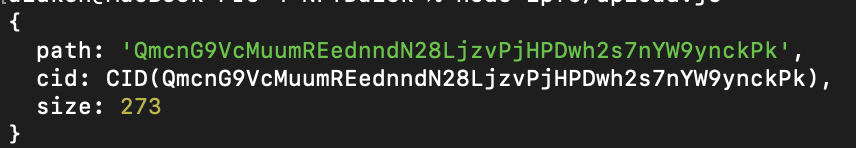

## Airdrop NFT
Lab to mint an NFT and then run a script to send it to a pre-defined list of public addresses [those of your friends or any random ones if you want! :)]

### Lab Requirements

* An HTTP endpoint from https://www.alchemy.com/ or https://infura.io/ to make blockchain queries
* A MetaMask testnet account private key with funds in it.
    * Go to https://faucet.rinkeby.io/ - this is an authenticated faucet, meaning you'll have to create a social media post on either Twitter or Facebook that contains the public address where you want to receive the test ether.

### Steps

#### Step 1: Set Up Project Structure

* Clone the repository
```
mkdir airdrop-nft && \
cd ./airdrop-nft && \ 
git init && \ 
git remote add origin -f https://github.com/GeorgeBrownCollege-Toronto/Smart-Contract-Essentials.git && \
git sparse-checkout init && \
git sparse-checkout set notes/tokens/ERC721/lab/airdrop-nft && \
git pull origin master && \ 
mv notes/tokens/ERC721/lab/airdrop-nft/* . && \
rm -rf ./.git ./notes
```
* Run `npm install`

* You now have the boilerplate set up of a past airdrop.Now, let's finish the project set up and then add our own NFT in!

* Run `npm install dotenv`
* Run `touch .env`
* Open the `.env` file and add in your RINKEBY_URL from the Alchemy or Infura. Add a `PRIVATE_KEY` from a test Rinkeby account that contains some Rinkeby ETH as well. Remember, these variables are used in the `hardhat.config.js` file, so if you run into any errors make sure you are naming them correctly!

Project setup done! Let's customize it for our own NFT and our own friends now.

#### Step 2: Customize Your Own NFT Airdrop

* First, go to the `upload.js` in the ipfs directory of the project
BTW, at this point feel free to rename the project from AirdropNFT to anything you like!

* Change the attributes of what was the AirdropNFT to anything you like!
* For this lab, we are going to go with making a copy-cat Bored Ape NFT on the Rinkeby testnet but we highly encourage you to come up with something of your own!

* This is what our `upload.js` looks like after we customized it:

```js
const { create } = require("ipfs-http-client");

const ipfs = create("https://ipfs.infura.io:5001");

// we added two attributes, add as many as you want!
async function run() {
  const files = [{
    path: '/',
    content: JSON.stringify({
      name: "A Bored Ape On Testnet",
      attributes: [
        {
          "trait_type": "Bored",
          "value": "100"
        },
        {
          "trait_type": "Leopard",
          "value": "100"
        }
      ],
      // if you want to upload your own IPFS image, you can do so here:
      // https://github.com/ChainShot/IPFS-Upload
      // or you can use https://www.pinata.cloud/
      image: "https://gateway.pinata.cloud/ipfs/QmYxT4LnK8sqLupjbS6eRvu1si7Ly2wFQAqFebxhWntcf6/",
      description: "Tongue is out! Leopard is on!"
    })
  }];

  const result = await ipfs.add(files);
  console.log(result);
}

run();
```

* Make sure you update the image property! Else your NFT will display a plain image! As is stated in the comments, you can do this by uploading an image using [IPFS-Upload Repo](https://github.com/ChainShot/IPFS-Upload) or you can use https://www.pinata.cloud/. The important thing is to make sure you update the content identifier, which is the long string starting with "Q" after `/ipfs/`
* Update the description property too!

Once you are happy with your final NFT metadata and image...

* Run `node ipfs/upload.js`



You will see a new path output on the terminal. Save this string, you will need it for the Step #4! The `Qmcn...` string will be your token uri.

#### Step 3: Deploy Your NFT Contract

Now it's time to actually deploy our ERC-721 contract from which we will mint our NFTs to ourselves and our friends - the possibilities are endless!

* In your contracts folder, open `AirdropNFT.sol`
* Change the name of the file, the contract name and the arguments passed in to the constructor.
This is what our `BoredApeTestnet.sol` file looks like:

```js
// SPDX-License-Identifier: MIT
pragma solidity ^0.8.0;

import "@openzeppelin/contracts/token/ERC721/extensions/ERC721URIStorage.sol";
import "@openzeppelin/contracts/utils/Counters.sol";

contract BoredApeTestnet is ERC721URIStorage {
    using Counters for Counters.Counter;
    Counters.Counter private _tokenIds;

    constructor() ERC721("BoredApeTestnet", "BATN") {}

    function awardItem(address player, string memory tokenURI)
        public
        returns (uint256)
    {
        _tokenIds.increment();

        uint256 newItemId = _tokenIds.current();
        _mint(player, newItemId);
        _setTokenURI(newItemId, tokenURI);

        return newItemId;
    }
}
```

* Save the file when you have made your customized changes - if you are making a `Spongebob` NFT, you would have named the contract `SpongeBobNFT` and the file `SpongeBobNFT.sol` -> they must match!

Since we made a few changes to our ERC-721 contract file, we need to reflect those changes in our deployment script...

* In the scripts directory, open the `deploy.js` file
* Edit all the Airdrop references, and change them to the BoredApeTestnet - or to whichever creative NFT you are deploying on your own!

This is what our `deploy.js` file looks like now:

```js
async function main() {
  const BoredApeTestnet = await hre.ethers.getContractFactory("BoredApeTestnet");
  const nft = await BoredApeTestnet.deploy();

  await nft.deployed();

  console.log("BoredApeTestnet deployed to:", nft.address);
}

main()
  .then(() => process.exit(0))
  .catch((error) => {
    console.error(error);
    process.exit(1);
  });
```

* Save the file.

Now, we are ready to deploy our ERC-721 contract!

* To deploy, run `npx hardhat run scripts/deploy.js --network rinkeby`

Your terminal should now output the Rinkeby address of your deployed contract!

#### Step 4: Mint NFTs (and some to your friends!)

Now it's time to actually mint our NFT using the ERC-721 contract we just deployed. There will also be an array that you can edit and input the Ethereum public address of anyone whom you might want to also mint the NFT to.

* In the `scripts` directory, open the `mint.js` file
* Again, make sure to remove all AirdropNFT references and instead replace those with your own.
* There is also an array called friends -> go ahead and copy-paste in a bunch of addresses of your friends/classmates so that when we run the `mint.js` file, they will receive an airdrop of the NFT!
* **Make sure to replace the** `existingContractAddr` **variable with that of your deployed ERC-721 contract from the last step!**
Here is what our `mint.js` looks like now:


Here is what our `mint.js` looks like now:
```js
const friends = [
    "0x491ff10fb0EF5859b80500Beb92a42fCe724e8af",
    "0x9C97d90C85a0D33B8dc45aE7af7b7144df7032A9",
    "0x2E7e5E02Bd40953D8C346a51D1B6D08C039CA6BD"
];
const existingContractAddr = "0xc4D9706145cD24e989b333D9aeE130EB22d1E4B8";

async function main() {
  const nft = await hre.ethers.getContractAt("BoredApeTestnet", existingContractAddr);

  const signer0 = await ethers.provider.getSigner(0);
  const nonce = await signer0.getTransactionCount();
  for(let i = 0; i < friends.length; i++) {
    const tokenURI = "https://gateway.ipfs.io/ipfs/QmcnG9VcMuumREednndN28LjzvPjHPDwh2s7nYW9ynckPk";
    await nft.awardItem(friends[i], tokenURI,  {
      nonce: nonce + i
    });
  }

  console.log("Minting is complete!");
}

main()
  .then(() => process.exit(0))
  .catch((error) => {
    console.error(error);
    process.exit(1);
  });
```

** **Make sure to replace the** `tokenURI` **in the for-loop to that of your own NFT from the end of Step #2 (the string after path:)**.

Our tokenURI is this one: https://gateway.ipfs.io/ipfs/QmcnG9VcMuumREednndN28LjzvPjHPDwh2s7nYW9ynckPk

>Notice the tokenURI simply contains all of the metadata associated to our NFT, including a reference to the image.

When you are ready to mint and have loaded up a bunch of friends into the friends array, you are ready to launch the airdrop!

* To mint and airdrop the NFT, run `npx hardhat run scripts/mint.js --network rinkeby`
Your terminal should output `Minting is complete`! once successful.

### Submission

* Submit the link for minted asset listed on testnet opensea.
for e.g. Check out our Bored Ape on Testnet NFT: https://testnets.opensea.io/assets/0xc4d9706145cd24e989b333d9aee130eb22d1e4b8/3
Note : If you are unable to list NFT to opensea, add ERC-721 contract address from step#3 to the submission.
